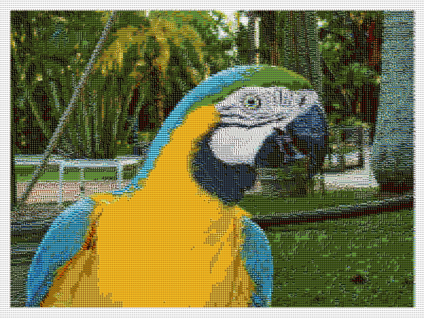

# Cuda Photomosaic

<!---Esses são exemplos. Veja https://shields.io para outras pessoas ou para personalizar este conjunto de escudos. Você pode querer incluir dependências, status do projeto e informações de licença aqui--->
> A program that creates a mosaic of an input image using a big set of smaller images


<p align="center">
  
</p>

## ❓ Possible future updates

* Optimize cache generation using a kernel
* Use Cuda concurrent data transfer
* OpenCl support
* Linux support

## 💻 Requirements

<!---Estes são apenas requisitos de exemplo. Adicionar, duplicar ou remover conforme necessário--->
* Cuda Sdk
* Cuda compatible GPU
* Windows machine
* Visual Studio 2019
* A <strong>BIG</strong> set of images

## 🏗️ Building

  Lorem ipsum dolor sit amet

## ☕ Creating a mosaic


```
// Command line arguments

--input -i -> Input image (path)
--output -o -> Output image (path/name.extension)

//optional
--quant -q -> Quantity of image blocks in X axis
--res -r -> Resolution of each individual block 
--update -u -> Update the image set cache
--gray -g -> Generate a grayscale image
```

Example:

```
$ photomosaic.exe -i C:\images\example.png -o C:\images\exMosaic.png -q 100 -r 50 -u c:\imageSet\ -g
```
OBS: In the first time you run the program you NEED to generate the cache

## ℹ️ Additional Info

My GPU specs:

```
Device 0: "NVIDIA GeForce GTX 1050 Ti"
  CUDA Driver Version:                           11.3
  CUDA Capability Major/Minor version number:    6.1
  Total amount of global memory:                 4096 MBytes (4294967296 bytes)
  ( 6) Multiprocessors, (128) CUDA Cores/MP:     768 CUDA Cores
  GPU Max Clock rate:                            1392 MHz (1.39 GHz)
  Memory Clock rate:                             3504 Mhz
  Memory Bus Width:                              128-bit
  L2 Cache Size:                                 1048576 bytes
  Max Texture Dimension Sizes                    1D=(131072) 2D=(131072, 65536) 3D=(16384, 16384, 16384)
  Maximum Layered 1D Texture Size, (num) layers  1D=(32768), 2048 layers
  Maximum Layered 2D Texture Size, (num) layers  2D=(32768, 32768), 2048 layers
  Total amount of constant memory:               65536 bytes
  Total amount of shared memory per block:       49152 bytes
  Total number of registers available per block: 65536
  Warp size:                                     32
  Maximum number of threads per multiprocessor:  2048
  Maximum number of threads per block:           1024
  Max dimension size of a thread block (x,y,z): (1024, 1024, 64)
  Max dimension size of a grid size (x,y,z):    (2147483647, 65535, 65535)
  Texture alignment:                             512 bytes
  Maximum memory pitch:                          2147483647 bytes
  Concurrent copy and kernel execution:          Yes with 5 copy engine(s)
  Run time limit on kernels:                     Yes
  Integrated GPU sharing Host Memory:            No
  Support host page-locked memory mapping:       Yes
  Concurrent kernel execution:                   Yes
  Alignment requirement for Surfaces:            Yes
  Device has ECC support:                        Disabled
  CUDA Device Driver Mode (TCC or WDDM):         WDDM (Windows Display Driver Model)
  Device supports Unified Addressing (UVA):      Yes
  Device supports Managed Memory:                Yes
  Device supports Compute Preemption:            Yes
  Supports Cooperative Kernel Launch:            Yes
  Supports MultiDevice Co-op Kernel Launch:      No
  Device PCI Domain ID / Bus ID / location ID:   0 / 1 / 0
```
